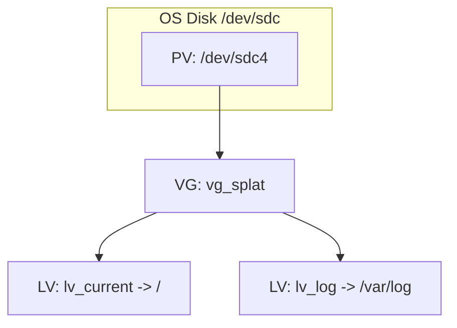
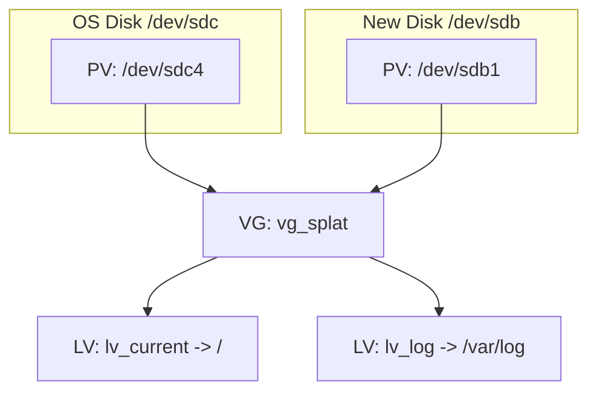

# Check Point GAiA Log Disk Layout (Premium SSD v2)

This note explains, in simple terms, what we did with the second disk and how the volume layout works.

## Goal (simple)
- We want **/var/log** to have more space and better I/O.
- GAiA keeps **/var/log** busy, so unmounting it is hard after boot.
- We therefore use **LVM** to extend the existing log volume while the system is running.

## Words used (simple)
- **Disk**: a physical disk (example: /dev/sdc for OS, /dev/sdb for the new disk).
- **PV (Physical Volume)**: a disk (or partition) that LVM can use.
- **VG (Volume Group)**: a pool of storage made from one or more PVs.
- **LV (Logical Volume)**: a “virtual disk” carved from the VG (like a slice).
- **Filesystem**: XFS on top of the LV (this is what /var/log uses).

## Current GAiA layout (original)
The GAiA image uses LVM. The log volume is a separate LV:

- VG: `vg_splat`
- LVs: `lv_current` (root `/`) and `lv_log` (`/var/log`)

## What the script does (high level)
When a second disk is attached (for example `/dev/sdb`):
1) Create a new PV on the second disk (example: `/dev/sdb1`).
2) Add the new PV to the existing VG (`vg_splat`).
3) Extend `lv_log` to use the free space.
4) Grow the XFS filesystem on `/var/log` (no unmount needed).

This gives `/var/log` more space immediately and keeps the system online.

## Does /var/log use the new disk for new writes?
Short answer: **Yes, it can**, but it depends on where the LV extents are.

- If `lv_log` **stays split** across both PVs, LVM will place new extents based on its allocation policy.
- If the second disk is **large enough**, we can **move all extents of `lv_log`** to the new disk with `pvmove`.
  - After a successful move, **all reads/writes for /var/log are on the new disk**.

To verify where the extents live:
- `lvs -o+devices /dev/vg_splat/lv_log`

## Why we did not unmount /var/log
- GAiA starts many services early and keeps /var/log busy.
- Unmounting it after boot usually fails.
- LVM `pvcreate` + `vgextend` + `lvextend` + `xfs_growfs` works **online** without unmount.

## What benefits from the second disk
- **Only /var/log** benefits, because only `lv_log` was extended.
- **Management DB / policy DB** are on other locations and do not move automatically.

## Summary (for non-technical readers)
- We added a second disk and attached it to the existing LVM storage pool.
- We made the log volume bigger and kept the system running.
- If we fully move the log volume to the new disk, all log I/O uses that disk.
- Other system data is not moved unless we explicitly do it.

