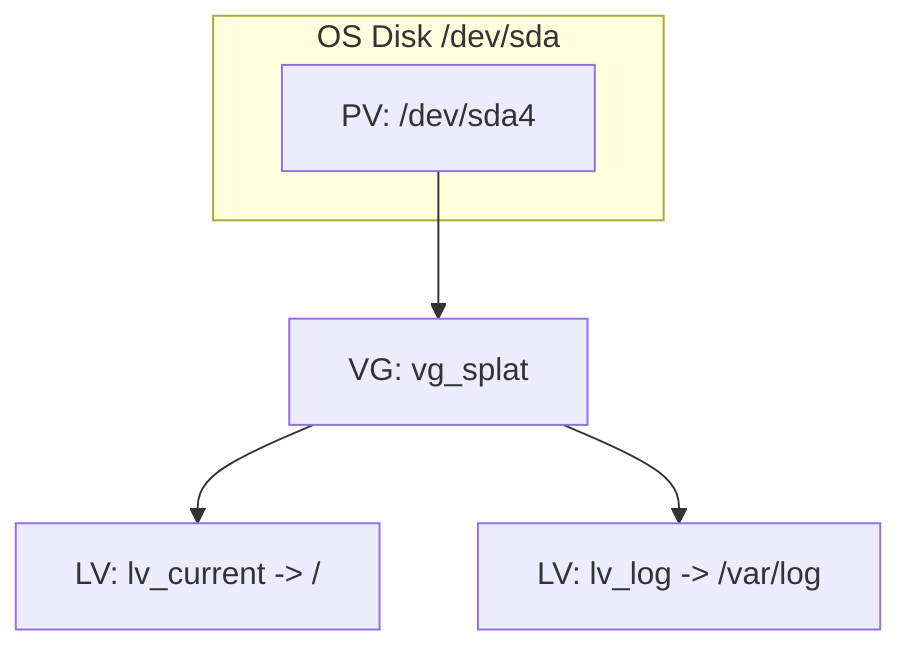
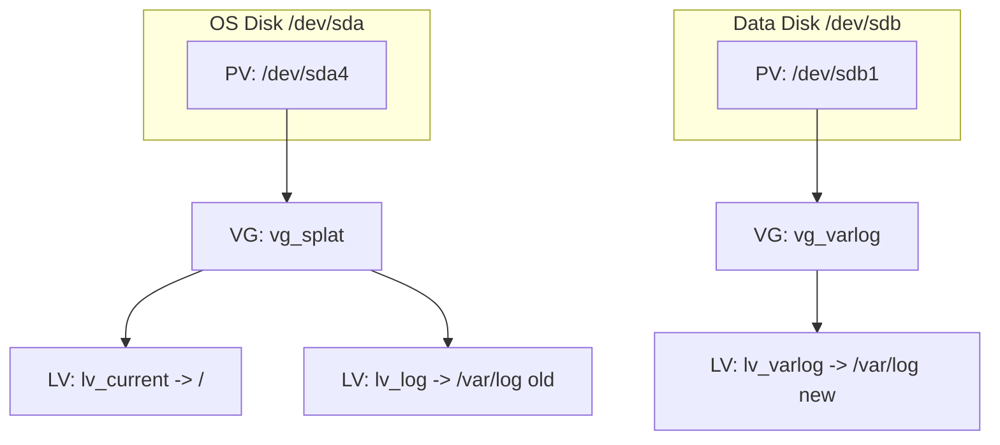

# Check Point GAiA Log Disk Layout (Premium SSD v2)

This note explains, in simple terms, what we did with the second disk and how the log volume layout works.

## Goal (simple)
- We want **/var/log** to have more space and better I/O.
- We want **/var/log** on a dedicated data disk (Premium SSD v2, 4K logical sectors).
- We avoid risky online data moves by **staging** and switching on **reboot**.

## Words used (simple)
- **Disk**: a physical disk (example: /dev/sda for OS, /dev/sdb for the new disk).
- **PV (Physical Volume)**: a disk (or partition) that LVM can use.
- **VG (Volume Group)**: a pool of storage made from one or more PVs.
- **LV (Logical Volume)**: a “virtual disk” carved from the VG (like a slice).
- **Filesystem**: XFS on top of the LV (this is what /var/log uses).

## Current GAiA layout (original)
The GAiA image uses LVM. The log volume is a separate LV on the OS disk:

- VG: `vg_splat`
- LVs: `lv_current` (root `/`) and `lv_log` (`/var/log`)



## What the script does (high level)
When a second disk is attached (for example `/dev/sdb`):
1) Detect the data disk (prefers Azure LUN symlink for stability).
2) Create a GPT + single partition (example: `/dev/sdb1`).
3) Create a 4K-aligned PV on the new disk.
4) Create a new VG `vg_varlog` and LV `lv_varlog`.
5) Format the LV as XFS with 4K sectors.
6) Copy current `/var/log` into the new filesystem (staging under `/mnt/newlog`).
7) Update `/etc/fstab` so `/var/log` mounts from the new LV.
8) Reboot to activate the new `/var/log` mount.



## Why we use a reboot instead of pvmove
- `/var/log` is busy very early in boot and is hard to unmount online.
- Online `pvmove` can be slow or risky on 4K disks if alignment is wrong.
- The script stages data and switches on reboot, which is safe and predictable.

## 4K sector alignment (Premium SSD v2)
Premium SSD v2 uses 4K logical sectors. The script:
- Creates the PV with `pvcreate --dataalignment 4K` on 4K disks.
- Formats XFS with 4K sectors (`mkfs.xfs -s size=4096`).

## Stable data disk identification (Azure LUN)
Device names like `/dev/sdb` can change across reboots. The script prefers the
stable Azure LUN path `/dev/disk/azure/scsi1/lunX` when available, which avoids
name drift and keeps `/var/log` intact after reboot.

## Summary (for non-technical readers)
- We added a second disk and used it only for `/var/log`.
- We created a new LVM volume group just for logs.
- We copied logs to the new disk, updated `/etc/fstab`, and rebooted.
- After reboot, all log I/O uses the new 4K-aligned disk.

## Post-deploy verification (fresh VM)
Run these after first boot and after reboot to confirm storage and services.

**Storage layout**
```
lvs -o lv_name,lv_path,devices
vgs -o vg_name,vg_attr,vg_size,vg_free
pvs -o pv_name,pv_size,pv_free,vg_name
df -h / /var/log
mount | grep '/var/log'
```

Expected:
- `/var/log` mounted on `vg_varlog-lv_varlog`
- XFS sectsz is `4096`

**LUN stability (Azure)**
```
ls -l /dev/disk/azure/scsi1
```

**Management services**
```
cpwd_admin list
api status
netstat -lntp | grep -E '18190|18191|18192|18210|443'
```

Expected:
- `cpwd_admin list` shows `CPD`, `FWM`, `CPM`
- Port `18190` is listening (SmartConsole)
- Other system data is not moved unless we explicitly do it.
